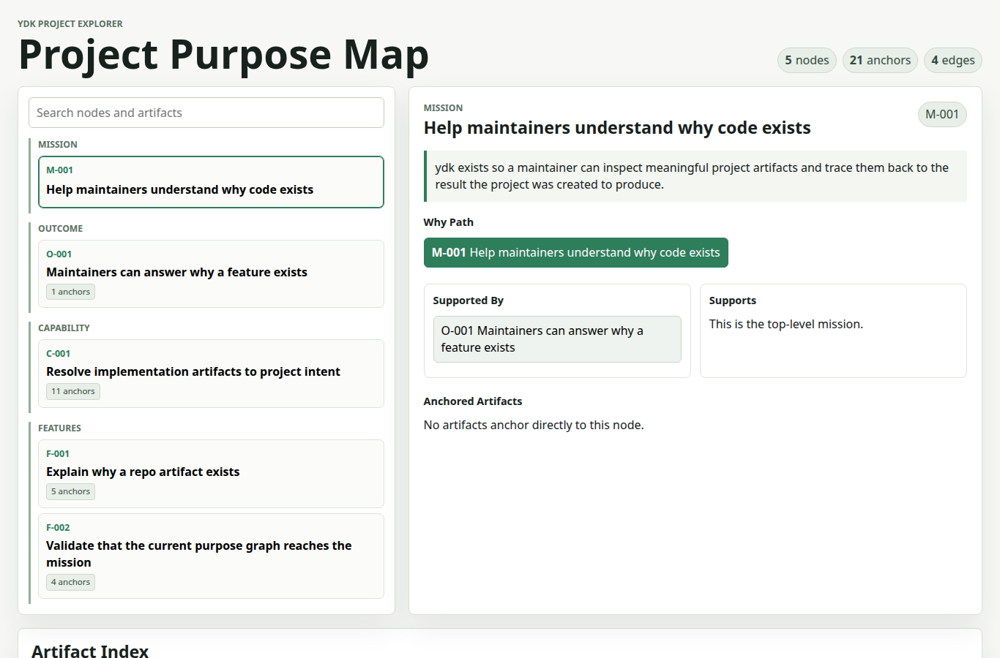

# ydk

`ydk` is a minimal example of a "why development kit": a repo-local purpose graph that can explain why meaningful artifacts exist.

This repository dogfoods the idea. `ydk` has a small built-in model, and the `.ydk/` directory defines the graph and anchors that connect project intent to this repository's own files.

## Try it

```bash
npm install
npm run ydk -- why src/cli.ts
npm run ydk -- trace F-001
npm run ydk -- validate
npm run ydk -- serve
```

## Configuration

```text
.ydk/
  graph.yaml    # defines this project's current purpose graph
  anchors.yaml  # maps repo artifacts to graph nodes
```

The important split is:

- `graph.yaml` defines this project's current intended purpose.
- `anchors.yaml` defines where that meaning touches the repo.

Supported anchor target kinds are documented in [docs/MODEL.md](./docs/MODEL.md#anchor-target-kinds).

The first promise of `ydk` is deterministic:

```text
Given a repo artifact, return a valid explanation path from that artifact to the project mission.
```

## Project Explorer

`ydk serve` starts a local browser UI for exploring the project as a purpose map:

```bash
npm run ydk -- serve
```

The explorer loads `.ydk/graph.yaml` and `.ydk/anchors.yaml`, shows the mission,
outcomes, capabilities, and features, and lets you inspect the artifacts anchored
to each purpose node.



## Possible Direction Examples

See [./docs/examples](./docs/examples/README.md).

Those examples are exploratory. They include fictional or proposed commands,
API shapes, and workflows to compare possible directions for `ydk`; they should
not be read as current CLI behavior.
