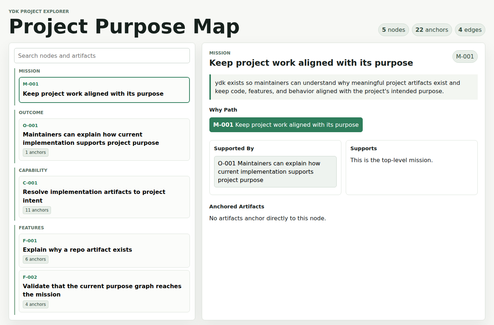
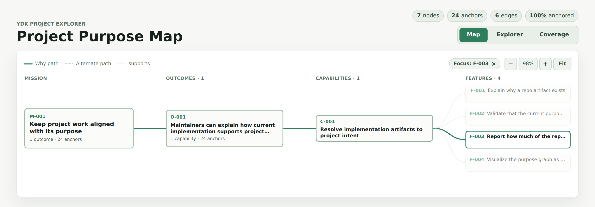
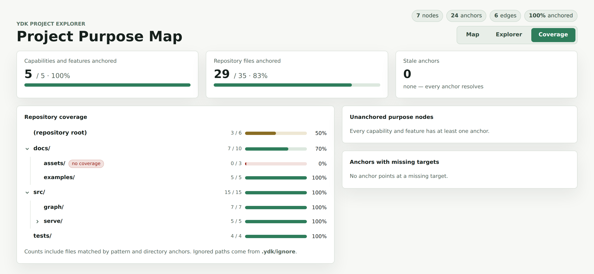

# ydk

`ydk` is a minimal example of a "why development kit": a repo-local purpose graph that connects meaningful artifacts to their intended purpose.

This repository dogfoods the idea. `ydk` has a small built-in model, and the `.ydk/` directory defines the graph and anchors that connect project intent to this repository's own files.

## Why?

Exactly.

If your question is how? Take a look at [pit](https://github.com/RyanJarv/pit).

These concepts might make sense to merge, but it's unclear how.

Really this is just an experiment... I'm not actually sure this really makes sense. I think you could probably think of it as effectively comments/documentation in graph form. My hope is that doing this helps expose inconsistencies that come about from generating large amounts of code. LLMs seem to be very good at making the right decision when they have the right information, but they rarely seem to have the right information...

## Try it

```bash
npm install
npm run ydk -- graph
npm run ydk -- why src/cli.ts
npm run ydk -- coverage
npm run ydk -- validate
npm run ydk -- serve
```

`ydk graph` prints the purpose graph as a tree rooted at the mission, with a
rollup of what sits beneath each node:

```text
M-001  Keep project work aligned with its purpose                                                               mission
└── O-001  Maintainers can explain how current implementation supports project purpose  1 cap · 4 features · 24 anchors
    └── C-001  Resolve implementation artifacts to project intent                               4 features · 23 anchors
        ├── F-001  Explain why a repo artifact exists                                                         6 anchors
        ├── F-002  Validate that the current purpose graph reaches the mission                                4 anchors
        ├── F-003  Report how much of the repo is anchored to the purpose graph                                1 anchor
        └── F-004  Visualize the purpose graph as a navigable map                                              1 anchor
```

`ydk coverage` reports how much of the project is connected to that graph:

```text
  nodes anchored   5 / 5   ██████████  100%
  files anchored  29 / 35  ████████░░   83%
  stale anchors    0
```

Add `--depth <n>` or `--flat` to `graph`, `--all-paths` to `why` and `trace`,
and `--unanchored`, `--stale`, or `--dirs` to `coverage`. Every command that
reads the graph also takes `--json`. Run `ydk <command> help` for the rest.

## Configuration

```text
.ydk/
  graph.yaml    # defines this project's current purpose graph
  anchors.yaml  # maps repo artifacts to graph nodes
  ignore        # optional: paths to leave out of coverage counts
```

The important split is:

- `graph.yaml` defines this project's current intended purpose.
- `anchors.yaml` defines where that meaning touches the repo.

Supported anchor target kinds are documented in [docs/MODEL.md](./docs/MODEL.md#anchor-target-kinds).

The first promise of `ydk` is deterministic:

```text
Given a repo artifact, return a valid explanation path from that artifact to the project mission.
```

## Project Explorer

`ydk serve` starts a local browser UI for exploring the project as a purpose map:

```bash
npm run ydk -- serve
```

The explorer loads `.ydk/graph.yaml` and `.ydk/anchors.yaml` and splits them
across three tabs. Each tab is a hash route, so any view is linkable:

- **Explorer** (`#/explorer`) — a collapsible outline of the graph with search
  and filters, plus the why path, neighbors, and anchored artifacts of the
  selected node. `#/explorer/F-001` opens straight to a node.
- **Map** (`#/map`) — the graph as layered columns, one per node type. Selecting
  a node highlights its path to the mission and dims everything off it.
- **Coverage** (`#/coverage`) — the same numbers `ydk coverage` prints, as stat
  tiles, a per-directory breakdown, and lists of unanchored nodes and stale
  anchors.







## Possible Direction Examples

See [./docs/examples](./docs/examples/README.md).

Those examples are exploratory. They include fictional or proposed commands,
API shapes, and workflows to compare possible directions for `ydk`; they should
not be read as current CLI behavior.
