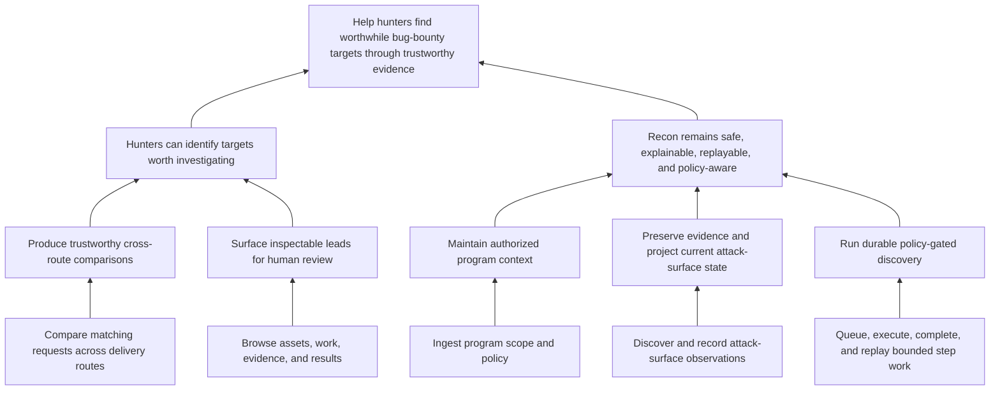

# bb-private Manual Onboarding

This study records a manual use of `ydk` against `/home/me/Code/bb-private`. It tests whether the current model can explain a large real repository and preserves the method and evidence that may later inform an `onboard` command.

The candidate configuration is stored beside this document:

- [`bb-private/graph.yaml`](./bb-private/graph.yaml) defines the proposed current-purpose graph.
- [`bb-private/anchors.yaml`](./bb-private/anchors.yaml) contains the representative anchors used for the trial.

## Status and boundaries

This was a read-only onboarding trial against commit `c6823c11` on branch `routes/origin-http-protocol` on 2026-08-21. The active checkout already had unrelated changes, so the trial exported the tracked files at that commit and installed the candidate `.ydk/` configuration only in a temporary directory. Nothing was written to `bb-private`.

The graph is a hypothesis for maintainer review, not an automated judgment about the repository. This trial does not rank graph conflicts or decide whether a disagreement is caused by the graph or the code; those judgments remain with the user.

## Alignment pass

- **Intent:** make `bb-private` artifacts explainable through the project's durable hunting purpose and identify where YDK strains on a large repository.
- **Ownership:** the candidate graph and trial evidence belong in YDK; no `bb-private` product or workflow behavior changes.
- **Necessity:** a thin graph and representative anchors are sufficient to test the current graph, `why`, validation, coverage, and explorer surfaces.
- **Simplification:** begin with authoritative boundaries instead of enumerating every subsystem, generated file, test, or hunt artifact.
- **Contention:** trustworthy route comparison is the current focus, but it remains one durable capability serving the hunting mission rather than becoming the mission itself.
- **Risk:** broad directory anchors can inflate file coverage while producing vague explanations; narrow anchors can understate how much implementation supports the graph.
- **Validation:** validate the configuration, inspect representative `why` paths, measure coverage and stale anchors, and leave semantic approval to maintainers.

## Approach

1. Read explicit project direction before deriving purpose from implementation structure.
2. Derive the mission from the durable reason the project exists, not the active workstream.
3. Express outcomes as observable results for the hunter and operator.
4. Express capabilities as durable abilities needed to produce those outcomes.
5. Express features as concrete repeatable behavior that exists now.
6. Anchor authoritative design and behavior boundaries before trying to cover every file.
7. Run `validate`, `graph`, `coverage`, and representative `why` queries against a clean tracked-file snapshot.
8. Record unresolved artifacts and product friction without automatically expanding the graph or inventing a fulfillment score.

The primary evidence was `AGENTS.md`, `README.md`, `docs/STRATEGY.md`, `docs/ARCHITECTURE.md`, `docs/design/invariants.md`, `docs/design/steps-as-configuration.md`, `docs/design/alignment.md`, `docs/work-policy.md`, `docs/schema/data-lifecycle.md`, `docs/queue-runtime.md`, `step/registry.go`, `step/topology.go`, and the current observation and review plans.

## Candidate graph



This graph deliberately gives safety, evidence, policy, and replay their own outcome path. Cross-route comparison and human review serve the hunting outcome. The split preserves the current comparison focus without reducing the project's durable purpose to one active workstream.

## Reproduction

From the YDK repository, the trial used a clean archive rather than the dirty active checkout:

```sh
trial_root=$(mktemp -d /tmp/ydk-bb-private-onboarding.XXXXXX)
git -C /home/me/Code/bb-private archive c6823c11 | tar -x -C "$trial_root"
mkdir "$trial_root/.ydk"
cp docs/onboarding/bb-private/graph.yaml "$trial_root/.ydk/graph.yaml"
cp docs/onboarding/bb-private/anchors.yaml "$trial_root/.ydk/anchors.yaml"

cd "$trial_root"
node /home/me/Code/ydk/src/launcher.ts validate
node /home/me/Code/ydk/src/launcher.ts graph
node /home/me/Code/ydk/src/launcher.ts coverage
```

The absolute launcher path is required because the candidate project does not install YDK. The temporary copy is also required because current commands load `.ydk/` only from the process working directory.

## Results

| Check | Result |
| --- | --- |
| Graph shape | 1 mission, 2 outcomes, 5 capabilities, 5 features, and 12 edges |
| Representative anchors | 26 |
| `ydk validate` | Valid |
| Anchorable node coverage | 10 / 10 (100%) |
| Tracked-file coverage | 302 / 1,691 (18%) |
| Stale anchors | 0 |
| Explorer project API | HTTP 200 with `validation.ok: true` |
| Explorer browser runtime | Initial trial: HTTP 500; after the YDK fix: HTTP 200 |

Representative queries produced useful explanations:

| Query | Resolved purpose |
| --- | --- |
| `AGENTS.md` | Mission |
| `docs/work-policy.md` | Maintain authorized program context |
| `step/discovery/dns/main.go` | Discover and record attack-surface observations |
| `pkg/records/enqueue.go` | Queue, execute, complete, and replay bounded step work |
| `step/probe/cdn-cloudflare/main.go` | Compare matching requests across delivery routes |
| `cmd/bb/internal/webapp/routecompare.go` | Compare matching requests across delivery routes |
| `cmd/bb/internal/webapp/assets.go` | Browse assets, work, evidence, and results |

The exact route-comparison file correctly overrides the broader web-app directory anchor. This shows that anchor specificity is useful when a subsystem has a general purpose but one artifact has a more precise reason for existing.

The first pass intentionally leaves substantial areas unexplained. Examples include `hunt/README.md`, `step/probe/crawl/main.go`, `pkg/utils/workpolicy`, `Makefile`, and systemd units. These are useful review prompts: some require more graph detail, some need more anchors, and some may belong outside the file-coverage denominator. Expanding them automatically would hide that decision.

## What the numbers do not mean

- 100% node coverage means every capability and feature has at least one anchor. It does not mean the implementation fulfills every node.
- 18% file coverage means 302 tracked files match at least one anchor. It does not mean the project fulfills 18% of its purpose.
- Zero stale anchors means the selected targets exist. It does not mean the selected reasons are correct.

This distinction is the most useful input for a future fulfillment metric: anchor presence, graph correctness, implementation behavior, and degree of fulfillment are different claims and should not be collapsed into one score without making those components visible.

## Significant YDK findings

### The explorer loaded its runtime from the inspected project

The explorer index and candidate project API both returned HTTP 200, and the API reported a valid project. The browser runtime still could not start because `/vendor/vue.esm-browser.prod.js` returned HTTP 500. `src/serve/server.ts` resolved that asset from the inspected project root, which made it look for `node_modules/vue` in the exported `bb-private` snapshot rather than in YDK's own installation. The active `bb-private` checkout does not contain that asset either.

An onboarded repository should not need to install YDK's private UI dependency. YDK now resolves the shipped Vue runtime from its own installation while continuing to resolve `.ydk/` and anchor targets relative to the inspected project. A regression test exercises that route with an external project root, and an end-to-end run from `bb-private` returned HTTP 200 for the explorer index, Vue runtime, and project API.

### A draft needs an external project root

Current commands load `.ydk/` from the working directory. Validating a proposed configuration without modifying the target repository required exporting the repository and copying the draft into it. A future onboarding workflow should accept an explicit project root and draft configuration location, or provide an equivalent dry-run workspace.

### Coverage is reach, not fulfillment

The trial reached 100% node coverage and 18% file coverage at the same time. Both are accurate, but neither answers how well the code fulfills a node. Directory anchors can also raise file coverage dramatically without improving explanation quality. The UI and any future metric should keep anchor reach, explanation quality, and fulfillment separate.

### One artifact can have several valid purposes

YDK resolves one best anchor and then traces paths from that node. `--all-paths` exposes multiple graph paths from the selected node, not multiple matching anchor meanings. Files such as `AGENTS.md`, `step/topology.go`, and shared record code legitimately contribute to several purposes. Onboarding needs an explicit policy for primary versus secondary reasons, or resolver support that can show several anchor relationships without making the default explanation noisy.

### Large directory coverage needs summarization controls

`ydk coverage --dirs` emitted hundreds of rows for this repository, including every nested generated-document, skill, and evidence directory. Depth limits, top-level summaries, or gap-focused sorting would make the CLI useful at this scale without changing coverage semantics.

### Repo-native behavior boundaries are coarser than files

Important `bb-private` boundaries include Go symbols, Make targets, CLI commands, generated systemd units, and database objects. The current repository-artifact model supports files, directories, file patterns, and package scripts; URL anchors cover product surfaces but do not address these boundaries. `src/graph/types.ts` contains a `SymbolAnchorTarget` type, but there is no corresponding resolver, validation, coverage, or documented query behavior, so symbol anchors are not currently usable. Before adding several ecosystem-specific anchor kinds, YDK should decide whether a small general artifact/symbol contract can preserve deterministic lookup and validation.

## Next manual iteration

1. Have maintainers review the mission, the two outcome paths, and whether the five capability boundaries reflect the project rather than only its current implementation.
2. Decide which unresolved artifact groups are product artifacts, generated mirrors, operational evidence, or development machinery before changing the coverage denominator.
3. Expand anchors from actual unanswered `why` queries, preserving exact anchors where a broad directory explanation is too vague.
4. Install the accepted configuration only in a clean `bb-private` worktree, then rerun validation, coverage, representative queries, and the browser explorer.
5. Use this study as input when comparing fulfillment-metric approaches; do not treat its coverage percentages as fulfillment labels.
